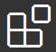
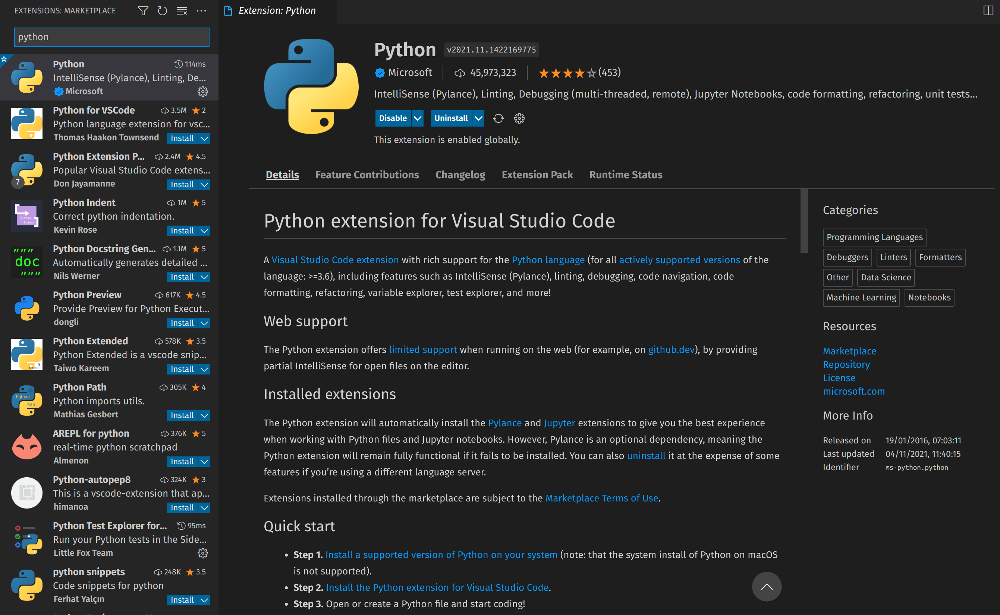
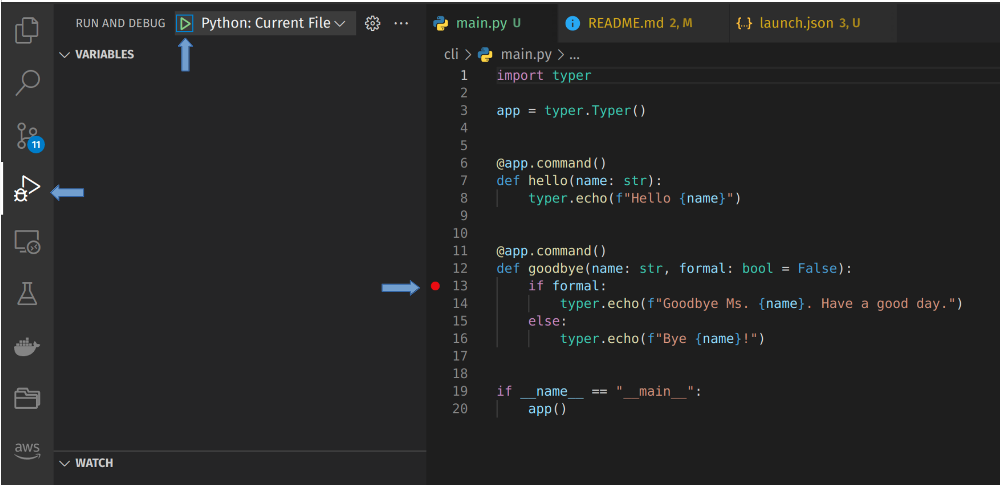
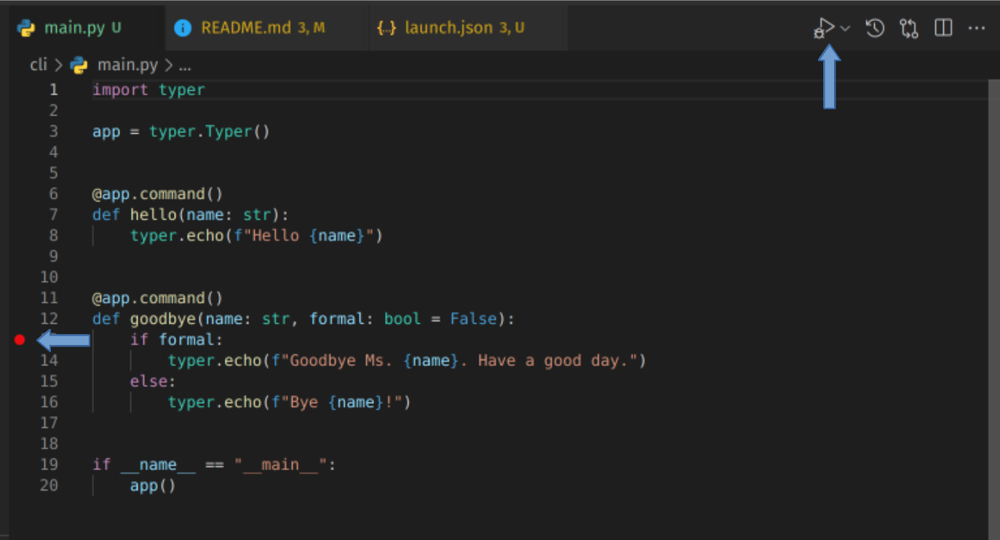
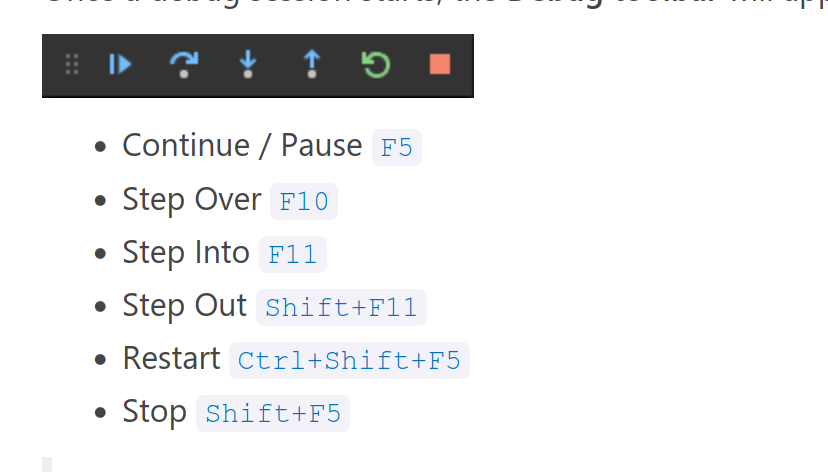
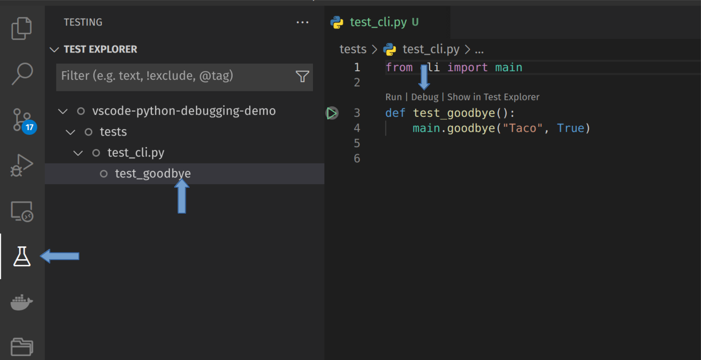
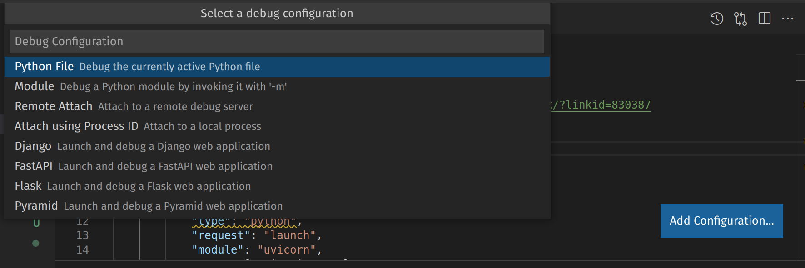

# VS Code Debugging Demo - Python

This README will walk you through a tutorial on using the Python debugger that is part of the Python extension for VS Code.

---

## Install

### Pipenv

This repo uses [Pipenv](https://pipenv.pypa.io/) for managing packages and the environment. The [Pipfile](Pipfile) contains all the required dependencies. If you are new to Pipenv, the following is to get up and running:

```shell
# Install Pipenv
pip install --user pipenv

# Optional, but recommended
export PIPENV_VENV_IN_PROJECT=1

# Create venv and install deps
pipenv install
```

### VS Code Python Extension

The Python Debugger is part of the Python Extension. Go to  in the side bar, and search for python. The extension is called `Python` and is authored by Microsoft, as shown below.



Click the install button.

---

## Debugging

Python can be used for a very wide variety of uses, such as: scripting, data science, backend apis, and more. So there are many ways to use a debugger depending on what you are doing. Below will be some of the common scenarios.

To run debugging, VS Code requires a `launch.json` which contains configuratoin on how to execute. 

### Script, Single File, and General Navigation

This is the basic scenario where you have a file to debug. In the `launch.json`, add the `Python File` configuration, which is as follows:

```python
{
    "name": "Python: Current File",
    "type": "python",
    "request": "launch",
    "program": "${file}",
    "console": "internalConsole"
}
```

Then to run the debugger, have the file open, and either use the side menu to run it, as shown in the image below:



Or run from the mini menu in the top menu, as shown in the image below:



You need to have a break point(s) set for the debugger to stop. Once the debugger is running, you will see a mini menu popup with the debugger controls, such as:



### Debug Tests

To debug specific tests, you will need to make sure the test tooling is configured. For example, for `pytest`:

```python
{
    "python.testing.pytestArgs": [
        "tests"
    ],
    "python.testing.unittestEnabled": false,
    "python.testing.pytestEnabled": true,
}
```

Once configured, you can view all your tests in the sidebar (see the image). You can hover over each test and some buttons will pop that will allow you to run/debug from the sidebar. Or, in the test file, there will be some labels above the function (see the image), where you can click `debug`.



### API Tests

VS Code can also integrate with some common api servers such as Django, Fast API, and Flask. You can open the `.vscode/launch.json` config file, and there is a `Add Configuration` button in the bottom right. Clicking this will open drop down with different language options, click on Python and you will get another drop down with all the Python options:



Debugging will run an api server on localhost, and allow you to hit the api using an request tool such as Postman or HTTPie. You can set breakpoints as usual, then send a request to the server and VS Code will stop the execution as usual.

## Docker Debugging

This is an advanced debugging topic. This involves using `tasks.json` and `launch.json`. For the example here, there is a `Dockerfile` with the code from the repo. There are tasks created in `tasks.json` for building and running the container. The best way to set this up is to use the Command Palette `<Ctrl><Shift><P>` and find `Docker: Add Docker file to Workspace`. This will create a basic `Dockerfile` and configure `launch.json` and `task.json`. From there you can edit the Dockerfile as needed. Then you can run the debug session from the debug sidebar.
